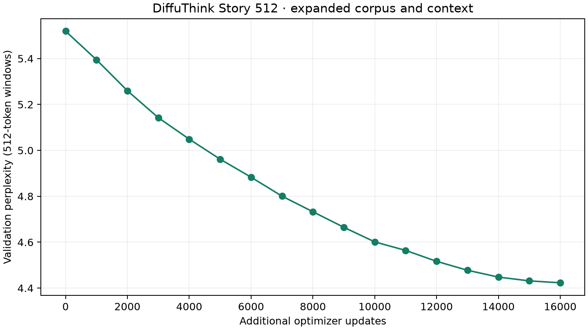

# DiffuThink Story 512 — expérience mesurée

Phase supplémentaire : **16,000 mises à jour**, 108,397,864 tokens non-PAD présentés, 36.7 minutes de boucle GPU et validation. Meilleur checkpoint sélectionné à l'étape 16000. Aucun poids externe.

Corpus : 500,000 récits synthétiques TinyStories contenant 107,857,284 tokens de texte, avant les présentations répétées pendant l'entraînement. 97.18% des récits tiennent entièrement dans une fenêtre. Les récits trop longs restent découpés ; EOS apparaît uniquement sur le dernier segment. Contexte 512 au lieu de 192 ; vocabulaire BPE identique ; mêmes documents de validation/test, nouvelle mise en fenêtres.

L'expérience combine corpus élargi, contexte étendu et davantage de calcul. Elle ne permet pas d'attribuer le gain à un seul de ces facteurs. L'objectif reste 90 % de lots causaux et 10 % de débruitage. La continuation est autorégressive.

## Comparaison contrôlée de vraisemblance

Les deux modèles sont évalués sur les **mêmes 1380 fenêtres test de 192 tokens**, avec exactement les mêmes cibles. Cette mesure isole une comparaison équitable des poids ; elle ne mesure pas l'avantage d'utiliser un contexte plus long en inférence.

| Mesure | Avant | Après |
|---|---:|---:|
| NLL, nats | 1.9749 | 1.8160 |
| Perplexité | 7.206 | 6.147 |
| Accuracy prochain token | 54.64% | 56.81% |
| Cibles | 189,300 | 189,300 |

La perplexité sur les nouvelles fenêtres de 512 tokens est publiée séparément dans report.json ; elle n'est pas directement comparable à l'ancien score sur 512 fenêtres de 192 tokens.

## Continuations : toutes les sorties

24 prompts × 2 seeds. Le premier prompt est le cas utilisateur déjà connu ; les autres ont été fixés avant inspection des nouveaux poids. Température 0,5 ; top-p 0,9 ; pénalité 1,12 ; interdiction des 4-grammes répétés ; plafond strict de 160 nouveaux tokens. Aucun choix du meilleur essai, aucune correction grammaticale, aucune marge de fin de phrase dans cette comparaison.

| Indicateur descriptif | Avant | Après |
|---|---:|---:|
| Fraction moyenne de trigrammes répétés | 1.93% | 2.69% |
| Arrêt par EOS | 83.33% | 72.92% |
| Sortie finissant par une ponctuation terminale | 89.58% | 75.00% |

Ces indicateurs ne mesurent pas la cohérence sémantique. Une terminaison EOS ne prouve pas que le récit est satisfaisant. Pas de revue humaine aveugle ni de score de cohérence automatisé revendiqué.

### 1. Seed 42 — One day a man was under a tree and

**Avant** — 155 tokens, arrêt `eos`

One day a man was under a tree and he saw a big tree. He wanted to climb the tree and see what was on top. So he started to climb up the tree. The tree was very tall and it was very high. 
The man was very happy when he reached the top. He looked down and saw a beautiful view. He could see the world from up there. It was so pretty and bright. He wanted it all to himself.
So he climbed higher and higher until he was at the top. Then he started to slide down again. He went up, down, down, and then slid down. He had so much fun! 
He went back down the tree and looked up at the sky. It was a beautiful day. He knew he would never forget this day.

**Après** — 155 tokens, arrêt `eos`

One day a man was under a tree and he saw something shiny in the ground. He bent down to pick it up and found a shiny metal coin. He put it in his pocket and ran home with it.
When he got home, he showed his mom the coin. She said it was very special and she said it was special. The man was so happy that he wanted to keep it forever.
The next day, the man went outside to look for more shiny things. He found a big tree with lots of leaves. He picked some and put them in his pocket.
The man kept looking until he found something even better - a shiny metal thing! He was so excited that he ran back inside to show his mom. She smiled and said it was the most beautiful thing he had ever seen.

### 2. Seed 7 — One day a man was under a tree and

**Avant** — 160 tokens, arrêt `length`

One day a man was under a tree and he was very tired. He had been playing all day and his friends were running away. He looked around and saw that the tree was very big. He decided to take a break and take a nap.
The man went to the tree and sat down. He sat down and closed his eyes. Suddenly, he heard a loud noise. It was a big truck coming towards him! The man was scared and ran away as fast as he could.
He ran and ran until he found a big tree. He opened it and saw the tree had fallen down. He was very sad and he started to cry. His friends came over and they told him not to worry. They said that it was okay and that they would get him a new home soon. 
The man was so happy!

**Après** — 160 tokens, arrêt `length`

One day a man was under a tree and he had to carry a big box. He walked and walked until he saw something shiny in the grass. It was a coin! The man was so excited that he picked it up and ran home.
When he got home, he showed his mom the coin. She said it was very pretty and she said it was special. The man was very happy and put the coin in his pocket. 
The next day, the man went to the park again. He saw a little boy playing with a ball. The boy wanted to play too, so he asked the man if he could play too. The man said yes, so the boy played with the ball.
The boy and the boy had lots of fun together. They were very happy and the man was happy to have such a special

### 3. Seed 42 — Mia put her blue cup on the table. When she came back,

**Avant** — 36 tokens, arrêt `eos`

Mia put her blue cup on the table. When she came back, it was soft and smooth. She smiled and said, "Thank you, Mommy!"
Mia and her little brother laughed too. They both laughed together. 
The end.

**Après** — 141 tokens, arrêt `eos`

Mia put her blue cup on the table. When she came back, it was broken! She looked around and saw that the cup was broken. Mia was sad.
"I'm sorry," said Mia. "My cup is broken."
Mia's mom heard the noise and came to see what happened. She saw Mia crying and asked her what was wrong. Mia told her about her broken cup.
Mom smiled and said, "Don't worry, Mia. I can fix it. Let's go find some glue and some tape."
They went to the store and found some glue. Mom put the pieces back together and soon the cup was fixed. Mia was happy again. She hugged her mom and said, “Thank you for helping me fix my cup!”

### 4. Seed 7 — Mia put her blue cup on the table. When she came back,

**Avant** — 141 tokens, arrêt `eos`

Mia put her blue cup on the table. When she came back, it was wet and slippery. Mia's little brother, Max, saw her. He wanted to play with Mia too.
"Can I play with your red cup?" he asked.
Mia nodded and said, "Yes, but be careful. It is very heavy."
Max took the yellow cup and put it on the table to make a big mess. The floor was wet and muddy. Mia and Max did not want to play with the blue cup anymore. They wanted to keep playing with it.
They decided to give the blue cup to Max. They took turns to pour water on it, and then they had fun. They made a big mess and did not make any more noise.

**Après** — 130 tokens, arrêt `eos`

Mia put her blue cup on the table. When she came back, it was very hot. Mia was happy to see her cup was still there. She took a sip and smiled. It was so nice!
Mia's mom saw her drinking the cup and asked what she wanted. Mia said, "I want to drink my water!" Her mom laughed and said, "Okay, but you need to be careful."
Mia asked, "What can I do?" Her mom said, "You can pour your water into a cup so it will be nice and cool." Mia was very excited and ran to get the cup. She poured the water into her cup and then drank it all up. It was delicious!

### 5. Seed 42 — Sam could not swim. He stood beside the deep pond and

**Avant** — 160 tokens, arrêt `length`

Sam could not swim. He stood beside the deep pond and looked at the water. He was scared, but he wanted to be brave.
"Don't be scared," Sam said. "I will protect you."
He ran to the edge of the pond and gently touched it. It felt soft and smooth. He felt a little bit better.
The water was warm and warm. Sam smiled and swam with his mom. He saw many things, like birds and fish. He saw ducks and frogs and butterflies. He saw some birds and some bugs.
"Look, mom, I found a fish!" he said.
His mom smiled and hugged him. She was proud of him too. She took him home and gave him a hug.
"You are a good helper," she said. "You helped me to be brave and smart

**Après** — 79 tokens, arrêt `eos`

Sam could not swim. He stood beside the deep pond and looked out at the sea. The water was so clear that it made Sam feel dizzy. He watched as the waves crashed against the shore.
"I'm sorry, Sam," said his mom. "It's okay to be scared sometimes."
Sam smiled and hugged his mom. He felt better after that. He decided to go back to playing in the water. 
The end.

### 6. Seed 7 — Sam could not swim. He stood beside the deep pond and

**Avant** — 80 tokens, arrêt `eos`

Sam could not swim. He stood beside the deep pond and looked for something to eat. Then he saw a big, juicy worm. He was so happy that he jumped up and down.
He took a bite of the worm and it was so delicious! He ate it all up and felt much better. 
Sam decided to go back to his cozy spot in the pond. He was very tired but he had a great time swimming with his friends.

**Après** — 159 tokens, arrêt `eos`

Sam could not swim. He stood beside the deep pond and looked around. He saw a frog sitting on a rock. The frog was sitting on a branch. Sam watched it for a while.
"Hello, frog," he said. "Can you help me?"
The frog smiled. "Of course I can. You can sit on my back."
Sam climbed up the tree and sat on the rock. He looked at the pond and saw some fish swimming in it. The frog watched Sam and smiled.
"Thank you, Sam," he said to the frog. "You are very kind."
The frog nodded. "You're welcome, Sam. You're a good friend."
Sam smiled back. He was happy to help the frog. He was glad that he could help the frog and the other animals in the pond.

### 7. Seed 42 — The little bird hurt its wing. It could not fly, so

**Avant** — 97 tokens, arrêt `eos`

The little bird hurt its wing. It could not fly, so it could not fly. The bird was sad and lonely. It wanted to help the bird, but it didn't know how.
Then, it saw a big tree. It flew down and saw a big branch. The bird thought, "I can help you." So it flapped its wings and flew down to the branch.
The bird flew up and up until it was at the top. Then it opened its mouth and flew away. The bird felt happy and safe again.

**Après** — 143 tokens, arrêt `eos`

The little bird hurt its wing. It could not fly, so it was very sad. The little bird wanted to help, but it couldn't.
One day, a kind man saw the bird and said he would help. He took the little bird to the vet's office. The doctor said that the bird needed to rest for a while.
The little bird was happy to help. It flew away to find some food. The kind man watched as the little bird flew away. The little boy was so grateful that he could help.
The kind man thanked the little bird for helping it. He gave the little bird a big hug and said goodbye. Then, the little bird went back to its home. It was happy to be able to help the little bird.

### 8. Seed 7 — The little bird hurt its wing. It could not fly, so

**Avant** — 132 tokens, arrêt `eos`

The little bird hurt its wing. It could not fly, so it couldn't fly anymore. It was sad and lonely.
One day, a kind girl saw the bird's hurt wing. She wanted to help it. The kind girl ran to her house and asked for some water. Her mom gave her some water and some water.
The kind girl was very happy. She thanked the kind lady and started to clean the bird. After a few days, the bird was able to fly again. It could fly again!
The little girl smiled and thanked the kind kind lady. The kind lady said she was glad that the little girl had helped it. They both enjoyed the rest of their day in the park.

**Après** — 111 tokens, arrêt `eos`

The little bird hurt its wing. It could not fly, so it couldn't fly anymore.
But then one day, the little bird saw a big, red balloon. It wanted to fly away, but it was too scared to fly. So, the little blue bird flew up and grabbed the balloon.
It flew higher and higher until it reached its nest. The little blue bird was so happy that it could fly again. It flew around with the balloon in its beak and smiled.
The little bird had a new friend. They played together every day, and the little blue duck was never alone again.

### 9. Seed 42 — Lucy gave her last cookie to her brother. Now she

**Avant** — 39 tokens, arrêt `eos`

Lucy gave her last cookie to her brother. Now she had a big smile on her face. She was so happy! 
The two of them hugged each other and smiled. They both knew that the cookie had made their day even more special.

**Après** — 160 tokens, arrêt `length`

Lucy gave her last cookie to her brother. Now she had a cookie and she was so happy! She ran around the house, looking for more cookies. 
Suddenly, Lucy heard a loud noise. It was coming from outside. She looked out of the window and saw a big, scary monster. The monster was huge and it had sharp teeth. 
Lucy was scared. She wanted to run away but she remembered her brother's words. He said "If you want some cookies, I will give you one." Lucy didn't know what that meant, but she knew it was something bad. 
The monster said "I will give you some of my cookies if you want". Lucy was so scared! She ran away as fast as she could. But the monster was gone. 
When Lucy came back to her brother's house,

### 10. Seed 7 — Lucy gave her last cookie to her brother. Now she

**Avant** — 58 tokens, arrêt `eos`

Lucy gave her last cookie to her brother. Now she had a cookie and was very happy. She smiled and hugged him.
"Thank you, Lucy," said her brother. "You are the best."
The two of them hugged and then went off to play. They had lots of fun together, and it was a wonderful day!

**Après** — 65 tokens, arrêt `eos`

Lucy gave her last cookie to her brother. Now she had a cookie and it was sweet. She smiled and said "Thank you!"
Her brother was so happy that he started to laugh. He said "You're welcome!"
Lucy smiled back and said "I'm glad you like the cookie." Then she gave him a big hug and they both enjoyed their cookie together.

### 11. Seed 42 — It was raining outside. The children decided to stay inside and

**Avant** — 82 tokens, arrêt `eos`

It was raining outside. The children decided to stay inside and play in the rain. They jumped in puddles and splashed around.
The rain was very wet, but the children were happy. They ran around in the mud and laughed. They had so much fun!
After a while, they got out of the mud and went back inside. They hugged each other and said goodbye. Then they went inside and played some more. The rain had made them feel better.

**Après** — 87 tokens, arrêt `eos`

It was raining outside. The children decided to stay inside and play in the rain. They laughed and ran around, playing in the puddles.
Suddenly, they heard a loud noise. It sounded like someone had gone away! They looked up and saw a big, white dog running towards them. 
The dog barked loudly and the children were scared. The dog ran away and the children ran back to their house. They hugged each other and promised never to be too wet and wet again.

### 12. Seed 7 — It was raining outside. The children decided to stay inside and

**Avant** — 105 tokens, arrêt `eos`

It was raining outside. The children decided to stay inside and play in the rain. They had a lot of fun playing together, but this time they were careful not to get wet.
Suddenly, a big storm came and destroyed their house! It was very loud and scary. The children were scared and started to cry. But then, the rain stopped and the rain stopped. The rain stopped and it was gone.
The children were so happy that they had been brave enough to play outside. They ran inside and hugged each other. They knew that their house was safe again.

**Après** — 112 tokens, arrêt `eos`

It was raining outside. The children decided to stay inside and play in the rain. They were having a great time, playing tag and jumping around.
Suddenly, they heard a loud noise. It was coming from the bushes. It was a big dog! The dog was barking and running towards them.
The children were scared, but they knew it was just a dog. They quickly ran away as fast as they could.
When they got back home, they were safe. The rain had gone and the sun was shining again. 
The children learned that sometimes the best things in life can be dangerous.

### 13. Seed 42 — The old man reached the top of the hill. He sat down to rest and

**Avant** — 154 tokens, arrêt `eos`

The old man reached the top of the hill. He sat down to rest and looked around. He saw a little girl playing in the grass. She was laughing and having fun. The old man smiled back at her and said, "Let's play a game!"
The little girl ran up the hill and started to run around. She laughed and laughed as she ran faster and faster. The old woman watched her and smiled. She had made it all to herself!
After a while, the little girl stopped and looked down at the old man. He was smiling back at her. The old lady smiled back and said, “You are so brave and kind. I'm glad you liked your game.”
The old man nodded and said, 'I'm glad you like it!” Then he walked away, still smiling from the little girl.

**Après** — 83 tokens, arrêt `eos`

The old man reached the top of the hill. He sat down to rest and looked around. He saw a big, red ball on the ground. He picked it up and said "This is so cool!" 
He decided to take it home with him. When he got home, he put the ball in his room. He was very happy. 
The old man went to bed that night feeling happy. He had a wonderful day playing with the ball and taking care of it.

### 14. Seed 7 — The old man reached the top of the hill. He sat down to rest and

**Avant** — 51 tokens, arrêt `eos`

The old man reached the top of the hill. He sat down to rest and looked up at the sky.
"It's so beautiful!" he said.
He smiled and said, "Yes, it is very pretty."
The old man was happy to be there. He was glad that he could make his life better.

**Après** — 160 tokens, arrêt `length`

The old man reached the top of the hill. He sat down to rest and looked up at the sky.
"What are you doing?" asked a little girl.
"I'm looking for my toy," said the old man. "I'm looking around."
The little girl smiled. She had never seen anything like it before. "Can I see it?" she asked.
The old man nodded. He took out his hand and showed her how to hold it. The little girl held onto the old man's hand, and he started to walk slowly.
"Be careful," said the little girl. "It's very high."
The old lady smiled. "I'll be careful," she said. She then reached out to grab the old man, and he pulled her down from the ground.
The little boy looked up and saw his toy.

### 15. Seed 42 — Ben lost his red hat in the garden. His sister helped him

**Avant** — 38 tokens, arrêt `eos`

Ben lost his red hat in the garden. His sister helped him find it and gave it back to him. Ben was very happy and thanked his sister. He learned that it's important to be kind to others and not let them have a bad ending.

**Après** — 160 tokens, arrêt `length`

Ben lost his red hat in the garden. His sister helped him find it, but he was not happy. He wanted to show her his hat, but he did not know how.
"Look, Lily, I found my hat!" Ben said, holding his blue hat. "It is so pretty and warm."
Lily looked at the hat and saw that it was not a hat. It was a hat with a star on it. She liked it too. She thought it was cool and wanted to keep it.
"Ben, don't do that!" Lily said, feeling sad. "You are a bad sister. You have your red hat. You can't take my hat."
But Ben did not listen. He took his blue hat and ran away with it. He left it on the ground and the house.
Lily was very sad

### 16. Seed 7 — Ben lost his red hat in the garden. His sister helped him

**Avant** — 92 tokens, arrêt `eos`

Ben lost his red hat in the garden. His sister helped him find it. She was very happy to have her hat back.
"Look, Ben! I found your hat!" she said. "You are a good brother and a good friend."
Ben looked at his hat. It was very pretty and soft. He smiled and hugged his sister.
"Thank you, Lily! You are a good sister," he said.
They hugged and laughed. They were happy to have each other and their toys.

**Après** — 56 tokens, arrêt `eos`

Ben lost his red hat in the garden. His sister helped him find it and gave it back to him. Ben was happy and said, "Thank you, sister!"
Mom smiled and said, “You're welcome, Ben! You are a good brother.”
Ben hugged his sister and said, 'I love you too, Mom'.

### 17. Seed 42 — The box was empty. Lily looked inside and

**Avant** — 160 tokens, arrêt `length`

The box was empty. Lily looked inside and saw a big, round box. She opened the box and saw a picture of her mom.
"Mom, can I have this box?" Lily asked.
"Sure, sweetie. You can have it," Mom said.
Lily took the box and ran to the box. She wanted to show her mom the box. But when she got there, she saw that the box was empty and not empty. It was too big for her.
"Oh no! My box is empty!" Lily cried.
Mom came into the room and saw the box. It was full of toys. Lily felt bad. She did not want to give up the box.
"I'm sorry, Mom. I wanted to see my new toy. Can we play with it now?" Lily said.

**Après** — 160 tokens, arrêt `length`

The box was empty. Lily looked inside and saw something shiny. She said, "What is this?"
Her mom smiled and said, "It's a magic key. You can use it to unlock things."
Lily was excited. She wanted to see what would happen if she opened the box. She asked her mom, "Can I open it?"
Her mother nodded and said, “Yes, you can open it.”
Lily carefully opened the box, and inside she found a beautiful dress. She put it on and felt like a princess. She was so happy! 
But then something bad happened. The dress started to move and Lily couldn't find it anywhere. She looked all around but couldn't find the key. She tried to get it back but it wouldn't budge.
Her mom said, "Don't

### 18. Seed 7 — The box was empty. Lily looked inside and

**Avant** — 89 tokens, arrêt `eos`

The box was empty. Lily looked inside and saw something very special. She found a bottle of water! She quickly grabbed it and ran to the box. 
Lily put the bottle on her head and ran outside to show her mom. Her mom smiled and said, "That's amazing! You can have the bottle now." 
Lily was so happy. She thanked her mom for the special gift. From then on, she always looked forward to going out and try something new.

**Après** — 102 tokens, arrêt `eos`

The box was empty. Lily looked inside and saw a little box. She wanted to open it, but it was locked. She tried to open the box, but it wouldn't budge.
Suddenly, a friendly dog came along. The dog said, "I can help you. I can help you open the box." The dog opened the box and found a key inside. He opened the box with the key.
Lily was so happy! She thanked the dog and gave him a big hug. Then she went back to playing in her room.

### 19. Seed 42 — A small dog was afraid of the loud thunder. Its owner

**Avant** — 160 tokens, arrêt `length`

A small dog was afraid of the loud thunder. Its owner had a big smile and she had a special pair of shoes. She took them to a park that was filled with lots of fun things to do.
The dog was so excited to be in the park. He wanted to explore the park, but his mom said he had to stay away from the loud thunder! The dog was scared, but he was also very curious.
He slowly walked towards the street and saw a big tree with lots of leaves. He ran up the tree and found a small box of yarn. He opened it up and saw that it was full of toys! He was so happy and quickly grabbed the yarn and started to play with it.
The big dog was so happy that he had found his shoes and he was no longer scared. He played with the yarn for

**Après** — 160 tokens, arrêt `length`

A small dog was afraid of the loud thunder. Its owner, a kind old man, said to him, "It's ok, I'm here to help you". The old man smiled and said, "I know, but I don't have any answers". He started to walk away, as if he could find a way to get back home.
The old man was very brave and he took the little dog to a big tree. When they got there, the old man saw that the little dog had taken him. The old man said, "You must never go near the tree again". 
The little dog was scared but he wanted to be brave. He slowly walked up to the old man and said, “I'm sorry I didn't know you could do it.” The old man looked at his face and smiled. He said,

### 20. Seed 7 — A small dog was afraid of the loud thunder. Its owner

**Avant** — 129 tokens, arrêt `eos`

A small dog was afraid of the loud thunder. Its owner had a plan to make it better, so she decided to take the dog with her. She put on her shoes and ran outside.
The dog saw a big tree in the middle of the road. It was very tall, but it seemed like it would be fun to climb it. So she started to climb.
When she reached the top, she looked around. There were lots of people there, and they all looked at her. The dog was so happy!
The dog smiled and waved goodbye to the people in the town. She had made a new friend and was very proud of herself for being brave and climbing the tree.

**Après** — 158 tokens, arrêt `eos`

A small dog was afraid of the loud thunder. Its owner, Sarah, was always very worried about the storm. She wanted to help the dog, but she didn't know how.
One day, Sarah's mom asked her, "What are you doing?" Sarah replied, "I'm going to help the storm." Her mom smiled and said, "That's a good idea! Let's go get some ice cream for the storm." 
So Sarah and her mom went to the store and bought some ice cream. When they got home, Sarah was so happy to be able to help the scary storm. She hugged her mom and thanked her for helping her. 
The storm passed and the sun came out. Sarah's mom said, "You did a great job! You helped the storm!" Sarah smiled and felt much better.

### 21. Seed 42 — Tom promised to return the toy before dinner. When the sun went down,

**Avant** — 21 tokens, arrêt `eos`

Tom promised to return the toy before dinner. When the sun went down, he was very happy. He smiled and said, "Thank you for helping me."
The End.

**Après** — 160 tokens, arrêt `length`

Tom promised to return the toy before dinner. When the sun went down, he was so happy that he ran outside to play with his friends. He showed them the toy and they all laughed.
The next day, Tom and his friends were playing hide and seek. Tom hid behind a big tree in the yard. All of a sudden, he heard a loud noise coming from the bushes. It was a big, scary bear!
Tom quickly ran to his friends and asked them to come out of the bushes. They all said yes, but they had to stay away from the bear. Tom was so scared that he couldn't move. He tried to hide in the bush but it was too late. The bear chased him and he got lost.
Tom never found his toy. His friends were sad, but they knew they had to help him. They searched high

### 22. Seed 7 — Tom promised to return the toy before dinner. When the sun went down,

**Avant** — 29 tokens, arrêt `eos`

Tom promised to return the toy before dinner. When the sun went down, he looked out of his window and saw a beautiful blue sky. He was so happy that he had found the toy and it made him smile.

**Après** — 92 tokens, arrêt `eos`

Tom promised to return the toy before dinner. When the sun went down, he said goodbye to his mom and ran outside. He was so happy to have been able to find the toy!
He ran around the garden, looking for something special. Suddenly, he spotted a small box in the grass. He ran over to it and opened it up. Inside was a toy that he had been searching for.
Tom was so excited. He quickly grabbed the toy and hugged it tightly. He knew he would never forget this day.

### 23. Seed 42 — Anna planted a seed and watered it every day. After a few weeks,

**Avant** — 160 tokens, arrêt `length`

Anna planted a seed and watered it every day. After a few weeks, the seed grew bigger and bigger until it was very small. Anna was so proud of her plant and wanted to show it to everyone.
One day, a big storm came and the rain started to fall. The rain was very strong and the sun was very hot. Anna's plant was very upset. She cried and cried. She wished she had listened to her mom and dad.
Anna ran to her mom, who was in the kitchen. She told her what happened and called the doctor. The doctor came and saw Anna crying. He felt sorry for her and said he would help her. He took Anna to the doctor and fixed her plant. He gave it back to Anna and said she was a very good plant.
Anna was very happy and thanked the doctor. She hugged her mom

**Après** — 160 tokens, arrêt `length`

Anna planted a seed and watered it every day. After a few weeks, the seed started to grow and became a beautiful flower. Anna was so happy that she ran around the garden to show her friends.
One day, Anna saw a butterfly flying in the sky. She wanted to catch it, but she knew she had to be careful. So she took a deep breath and stepped closer to the butterfly. The butterfly flew away and Anna watched it fly away.
Anna was so excited that she decided to take a break and see if she could find another flower. She looked around for a flower, but she couldn't find one. Then she noticed something in the grass. It was a beautiful flower!
Anna picked up the flower and put it in her pocket. She went back to her garden to look for more flowers. After a while, she found a big

### 24. Seed 7 — Anna planted a seed and watered it every day. After a few weeks,

**Avant** — 93 tokens, arrêt `eos`

Anna planted a seed and watered it every day. After a few weeks, the plant grew bigger and bigger until it became a beautiful flower.
One day, Anna's mom asked her to help with the garden. She said, "Let's make a beautiful flower, so we can grow big and strong." 
Anna was excited to help. She worked hard to put the flower in a pot. When they were done, the flower looked very pretty. Anna smiled and said, "Thank you, mom! I love my flower!"

**Après** — 160 tokens, arrêt `length`

Anna planted a seed and watered it every day. After a few weeks, the seed began to grow and grew until it was big and beautiful.
One day, Anna decided to take a break and rest for a while. She sat down in the grass and closed her eyes. Suddenly, she heard a voice say "Hello!"
Anna opened her eyes and saw an old man standing there with a smile on his face. He said "Hi, I'm here to help you."
Anna was so excited! She asked the old man if he could help her. The old man smiled and said "Of course!"
So Anna and the old man worked together to make the seed grow. After some time, they were able to plant it in a new garden.
Anna thanked the old man and said goodbye. She was so happy that she had been able to help

### 25. Seed 42 — The girl could not reach the shelf. She asked her father to

**Avant** — 159 tokens, arrêt `eos`

The girl could not reach the shelf. She asked her father to help her. His dad said he would help her get it. He took out a big box and filled it with water. Then he put it on the table.
The girl was so happy when she saw the shelf. It was tall and shiny. She smiled and hugged her dad. They both felt good inside. 
The girl ran to the shelf and looked at all the toys. She wanted to buy them, but she couldn't find any. She started to cry.
Her dad came back with a big smile. He gave her a hug and said he was sorry. He said he would take care of her and help her find some new toys. 
They went back to the shelf together. The girl smiled as she watched her dad. It was a fun day!

**Après** — 136 tokens, arrêt `eos`

The girl could not reach the shelf. She asked her father to help her. He was a bit scared, but he said yes.
The girl and her father walked to the shelf. The girl looked at the shelf with big eyes. She saw many things she wanted to do.
"Can I climb on the shelf?" she asked her father.
Her father smiled and said, "Yes, you can climb on it."
The girl was so happy. She climbed on top of the shelf. It was fun! The girl felt like she was flying. 
She reached the top of the chair and looked around. She saw lots of things. There were books, toys, and books. She was so excited to explore.

### 26. Seed 7 — The girl could not reach the shelf. She asked her father to

**Avant** — 136 tokens, arrêt `eos`

The girl could not reach the shelf. She asked her father to help her. His father said, "We need to find something."
So they went to look for a toy that was hidden under the bed. They found it very carefully and put it in the shelf. Then they looked at the shelf. It was full of things that were very special.
The girl was so happy. She hugged her father and said, "Thank you! I'm so glad we found this shelf." Her dad smiled and said, “You're welcome. Now let's go have some fun!” 
And they went to the store together. The girl had a great time at the store and she was very proud of herself for being so thoughtful.

**Après** — 127 tokens, arrêt `eos`

The girl could not reach the shelf. She asked her father to help her. He said, "It's too high for you. You need to be careful."
The girl was sad but she listened to her father. She looked around and saw a big box. It was full of books. The girl wanted to read the book. She opened it and started to read.
She found a book with pictures of animals. She read the words and learned new things. She learned about animals, plants, and flowers. She was happy.
The girl learned a lot from her father. He said it was his job. He said he could read more books later. The girl was happy.

### 27. Seed 42 — A rabbit found a carrot. Instead of eating it alone,

**Avant** — 100 tokens, arrêt `eos`

A rabbit found a carrot. Instead of eating it alone, he decided to take it home and make sure it was safe. He thought about how important it was to share his own food with others.
He hopped around the forest looking for food. Finally he found some seeds that he wanted to share with others. He ate the seeds and felt happy that he had made a new friend.
The rabbit thanked the rabbit and ran home. He was so excited to show his family what he had done. He smiled, knowing he had made someone else happy.

**Après** — 160 tokens, arrêt `length`

A rabbit found a carrot. Instead of eating it alone, he decided to take a bite. He was so excited that he started to eat the carrot. It tasted so good! He ate the whole carrot and felt happy.
The rabbit kept eating the carrot until the sun went down. Then he hopped away, feeling very tired. He had been looking forward to getting to eat the delicious carrot. 
But then he heard a voice. It was his mother. She said, "What are you doing? That's my carrot!" The rabbit was so surprised that he stopped eating and looked at his mother. His mother smiled and said, "That's very sweet of you! Now let's go and get some more carrots." 
The rabbit was so happy that he had been able to eat the yummy carrot! He thanked his mother for taking him

### 28. Seed 7 — A rabbit found a carrot. Instead of eating it alone,

**Avant** — 131 tokens, arrêt `eos`

A rabbit found a carrot. Instead of eating it alone, he decided to take it home with him. He was so happy to have his carrot back.
The rabbit went back to the forest and looked for the carrot. But it was gone! He was so sad. He looked around but couldn't find any more carrot.
Then he heard a voice. It was an old owl. The owl said, "I can help you find your carrot."
The rabbit was so happy! He thanked the owl and hopped away.
The next day, the rabbit went back home. He was still very sad. But he knew that his carrot was still there, so he decided to look for it again.

**Après** — 160 tokens, arrêt `length`

A rabbit found a carrot. Instead of eating it alone, he was very hungry. He looked around for something to eat, but he could not find anything.
He decided to go on an adventure and find some food. As he hopped along, he saw a big tree with lots of carrots. The rabbit wanted to get the carrot, so he hopped closer and closer. 
But when he got close, he heard a loud noise! It was coming from the tree! He was scared, but he kept hopping until he reached the tree. There he found a big pile of carrots.
He quickly grabbed one of the carrots and started to eat it. He ate it all up and felt much better. He had found something to eat and he was very happy. 
The rabbit was glad that he had found the carrot and he hopped away with

### 29. Seed 42 — Max broke his friend's toy by accident. He felt sorry and

**Avant** — 133 tokens, arrêt `eos`

Max broke his friend's toy by accident. He felt sorry and ashamed. He said he was sorry and hugged his friend.
"I'm sorry, Max. I didn't mean to break your toy. I just wanted to play with you. Can we play together?" Lily said.
Max smiled and hugged her back. He said, "Okay, let's play together. But first, let's clean up this mess and put the toys back in the box. Then we can both have fun."
Lily nodded and they hugged. They learned that sharing is caring and that it's okay to make mistakes sometimes. They also learned that some things are not always nice and that it is important to be kind to others.

**Après** — 140 tokens, arrêt `eos`

Max broke his friend's toy by accident. He felt sorry and wanted to make it up to her. He found a pair of scissors and started to cut the toy.
"Hey, what are you doing?" Max asked.
"I'm cutting my new toy," he said.
His friend looked at him and smiled. "That's very nice of you, Max," she said. "But you have to be careful with it. It's sharp and can hurt you."
Max nodded and put the scissors back in the box. He felt proud that he had been careful with his new toy.
The moral of the story is: Don't touch things that are not yours. Do not use them too much, or you might break something.

### 30. Seed 7 — Max broke his friend's toy by accident. He felt sorry and

**Avant** — 99 tokens, arrêt `eos`

Max broke his friend's toy by accident. He felt sorry and ashamed. He said, "I'm sorry, mom. I wanted to play with my new toy. Can we play together?"
His mom smiled and said, "Of course, Max. We can play with your new toy together. But first, let's put it back in the box."
Max nodded and hugged his mom. He was happy again. He played with his new toy until it was time to go home. He said goodbye to his new friend and went to bed.

**Après** — 107 tokens, arrêt `eos`

Max broke his friend's toy by accident. He felt sorry and wanted to help his friend. So he picked up the broken pieces and put them back together.
Max was happy that his friend was okay. He said, "I'm sorry I made a mistake. I will be more careful next time." His friend smiled and said, "It's okay. Let's go get some ice cream."
So they went to the store and bought some ice cream. Max was very happy and thanked his friend again. They both enjoyed their ice cream and were glad that they could help each other.

### 31. Seed 42 — The snow melted in the warm sun. The children

**Avant** — 78 tokens, arrêt `eos`

The snow melted in the warm sun. The children were so excited to go outside and play. They ran around, playing tag and laughing.
Suddenly, a big wave came and blew the snow away. It was so cold that it made the children sad. 
They looked up at the sky and saw the snow was gone. But they knew that they had to be careful. So they went back inside and watched the snow again.

**Après** — 118 tokens, arrêt `eos`

The snow melted in the warm sun. The children were so excited to see it. They ran around, playing in the snow.
"Look at all the snow!" said one of them. "It's so cold and icy!"
The children laughed. They loved the snow. It was so much fun!
Suddenly, a big gust of wind blew through the sky. The children jumped up and down and laughed.
"Let's go inside!" they shouted. But it was too late. The snow started to melt away. 
The children were sad. They had lost their icy snow and the snow was gone forever.

### 32. Seed 7 — The snow melted in the warm sun. The children

**Avant** — 125 tokens, arrêt `eos`

The snow melted in the warm sun. The children were very happy and they all ran around the snow together.
Then, they saw a big hill. They wanted to climb it, so they started to climb. As they climbed higher, the ground became rough and slippery. 
Suddenly, the wind blew and the snow stopped. The children ran to the hill to get their hands. They were so happy! They had climbed up the hill and were able to climb the hill.
The children were so proud of themselves for climbing so high. They smiled and laughed as they slid down. They had a great time, and they knew that they would never forget it.

**Après** — 111 tokens, arrêt `eos`

The snow melted in the warm sun. The children were so happy and excited to go outside. They ran around, laughing and having fun.
Suddenly, a big dog came running towards them. It was barking loudly and making a lot of noise. The children got scared and started to run away. But the dog chased after them and they were too fast.
The dog chased them all around the snow, but it was too late. The dog had already gone away and the children couldn't get back home. They were very sad and scared. 
The dog never made it back home again.

### 33. Seed 42 — Two friends built a small boat. They put it on the water and

**Avant** — 117 tokens, arrêt `eos`

Two friends built a small boat. They put it on the water and watched it sail away.
One day, they decided to go to the beach. The sun was shining brightly and the waves were bright blue. 
The friends wanted to explore the sand. So they got out of the boat and started to dig.
They found a big rock and put it in the sand. They were so happy!
They had a great time playing in the sand, splashing and splashing around.
When it was time to go home, they said goodbye to their new friends. It was a beautiful day and they couldn't wait to come back again.

**Après** — 71 tokens, arrêt `eos`

Two friends built a small boat. They put it on the water and sailed it around the house.
One day, they decided to build a boat out of sticks and stones. They worked hard and soon the boat was complete.
The two friends were so proud. They looked at each other and smiled.
Then, they sailed back home. They had built a big boat and the other one had a better boat.

### 34. Seed 7 — Two friends built a small boat. They put it on the water and

**Avant** — 160 tokens, arrêt `length`

Two friends built a small boat. They put it on the water and watched it sail away.
The little girl was so excited to see the boat that she asked her mom if they could go outside and play. Her mom said yes, so they went outside.
They saw a big hill and decided to go up there. The little girl was very excited to see what was on the other side of the hill. She wanted to explore it, but her mom said no.
The two friends started to fight over the big hill. They were very impatient and didn't want to leave.
But then, they heard a voice from behind them. It was their mom. She said that it was time for the little girl to go home. So they went back inside and had dinner.
They had a great day at the lake and they couldn't wait to

**Après** — 89 tokens, arrêt `eos`

Two friends built a small boat. They put it on the water and sailed around it. The boat was so big, it was the most beautiful thing they had ever seen!
One day, the two friends decided to build a boat. They worked hard, and soon they had made a big, strong boat. It was so strong that they could not move it anymore.
The friends were very proud of their boat. They had built a big, beautiful boat. They were so happy with their new boat.

### 35. Seed 42 — Sara heard a kitten crying behind the fence. She

**Avant** — 117 tokens, arrêt `eos`

Sara heard a kitten crying behind the fence. She ran to the fence and saw that it was broken. It had a red mark on it and a hole in it. Sara felt sorry for the kitten.
"Don't worry, kitten," she said. "I will help you." She ran to get her mom and dad. They were very happy to see the kitten. They hugged Sara and thanked her.
Sara's mom and dad hugged them back. They told them that they were proud of their daughter and that they loved them very much. Sara felt happy and proud. She knew that the kitten was a good kitten.

**Après** — 160 tokens, arrêt `length`

Sara heard a kitten crying behind the fence. She went to see what it was, but she saw that it had a hurt wing. It was very small and had a red collar. Sara felt sorry for the kitten and wanted to help it.
She picked up the kitten and held it in her hand. The kitten looked at Sara with its big eyes and licked her face. Sara smiled and said, "It's okay, kitten. I'm here to make sure you feel better." She gently rubbed the kitten's back and the kitten felt better.
The kitten was happy and said, Okay, it would be fine. Sara and the kitten played together in the park until it was time for them to go home. Sara hugged the kitten and said, “Thank you for being my friend. You are very kind.” The kitten purred and

### 36. Seed 7 — Sara heard a kitten crying behind the fence. She

**Avant** — 135 tokens, arrêt `eos`

Sara heard a kitten crying behind the fence. She ran to her mom and asked, "Mommy, what's wrong?"
Her mom said, "The kitten was not nice to be so loud. It was just hungry. You should be gentle with its tail."
Sara nodded and said, "I'm sorry, mommy. I wanted to help it. Can we make some cookies for the kitten?"
Her mother smiled and said, “Of course, Sara. We can make some cookies together. Let's make a cake together. It will be fun!”
Sara smiled and said thank you. She was happy to help her mom. They made a new cake together. They were happy and proud of their work.

**Après** — 151 tokens, arrêt `eos`

Sara heard a kitten crying behind the fence. She went to see what was wrong. She saw a small kitten stuck in the fence. The kitten was scared and ran away. Sara felt sorry for the kitten.
"I'm sorry, kitten," Sara said. "I didn't mean to hurt you."
The kitten looked at Sara and licked her hand. It was not angry anymore. It was just scared. Sara smiled and said, "It's okay, kitten. I'm not mad at you. You are my friend."
Sara hugged the kitten and said,
"Thank you, kitten. You are a good friend too. Do you want to play with me?"
The kitten nodded and ran away from Sara. Sara felt better. She was happy to have a new friend.

### 37. Seed 42 — The baker had no flour left. To make more bread, he

**Avant** — 99 tokens, arrêt `eos`

The baker had no flour left. To make more bread, he was very sad. He wanted to make something special.
He went to the kitchen and found some flour, sugar, and eggs. He put the flour in the oven and waited. After a while, he decided to bake it.
He mixed the flour and sugar together and put them in the oven. Then he put the pan in the oven to bake. It smelled so good!
The baker was happy that his cake was ready. He smiled and said "Thank you, mommy!"

**Après** — 121 tokens, arrêt `eos`

The baker had no flour left. To make more bread, he was very sad. He wanted to make something special.
He looked around and saw a big piece of paper on the table. He thought it would be fun to make something with it. So he started to cut the paper into shapes.
But then he heard a loud noise. It was the baker! She had made a mess in the kitchen. The baker was very angry. He grabbed a knife and tried to put it away. 
The baker was very sad and scared. But then he saw the cake and he smiled. He was glad that he could make something special with the scissors.

### 38. Seed 7 — The baker had no flour left. To make more bread, he

**Avant** — 115 tokens, arrêt `eos`

The baker had no flour left. To make more bread, he was very angry. He wanted to give his eggs back to her and make him feel better.
He went to the kitchen and saw a big bowl of butter. It looked so yummy! He took it out and started to eat it. The butter felt so good that he ate it all up! 
The waiter came and gave him some of the butter. The baker was very happy and thanked the waiter for his help. He said, "You are a very kind helper!" 
The Remy smiled and hugged his bowl. He knew he had done something wrong.

**Après** — 160 tokens, arrêt `length`

The baker had no flour left. To make more bread, he was feeling sad. He wanted to make a cake.
He asked his friend, the little girl, for help. She said, "I can help you. I can make a big cake." 
The baker smiled. He got some flour and sugar. He put them in the oven. Then he took it out and put it on the table.
The little girl was so happy. She said to the baker, "Thank you!" The baker smiled.
He then opened the oven door. Inside, he found a big bowl of butter. He took it out of the oven and began to stir it with his hands.
The cake was delicious! He thanked the baker and gave him a hug. The little girl said, "You're welcome!" 
They both enjoyed the

### 39. Seed 42 — A boy found a lost key on the path. He wanted to

**Avant** — 73 tokens, arrêt `eos`

A boy found a lost key on the path. He wanted to find it, but he was too small to reach it. So he asked his mom if he could help. She said yes and they both went to look for the key.
They searched high and low until they found it. It was so shiny and sparkly! The boy was so happy that he jumped up and down with joy. He had found the key!

**Après** — 150 tokens, arrêt `eos`

A boy found a lost key on the path. He wanted to help it, so he ran around looking for the key. But no matter how hard he tried, the key wouldn't go away.
He asked his friends for help, but they couldn't hear him. Then, one of them had an idea. They said that if he was very careful, he would take the key and put it in a safe place. The boy was so excited!
So, the boy and his friends took the key to the treasure chest. Inside, they found a beautiful, new toy. It was a shiny red car with a big bow on top. They were so happy!
The boy thanked his friends for helping him find the key. He promised to always be careful when he was playing with his friends.

### 40. Seed 7 — A boy found a lost key on the path. He wanted to

**Avant** — 160 tokens, arrêt `length`

A boy found a lost key on the path. He wanted to find out what was inside, so he decided to take it and explore the new place.
He walked through the park and soon he saw a big tree with a hole in it. He was very excited and started to climb up the tree. But as he got closer, he heard a voice behind him.
"Hey little boy! What are you doing here?" It was a friendly old man.
The boy was surprised and he asked, "What are you doing?"
The old man smiled and said, "I'm just trying to find my way out of the tree."
The boy smiled and said "I know what? I wanted to help you get to the new place." 
The old lady thanked him and they both walked away together. The boy was very happy that

**Après** — 129 tokens, arrêt `eos`

A boy found a lost key on the path. He wanted to help, so he picked it up and took it home. He showed it to his mom and she smiled. She said it was very special and that the boy should keep it safe.
The boy put the key in his pocket and ran back home. He was so excited to show his family his new key. His parents were so proud of him for being so helpful. They hugged him and gave him a big hug. 
From then on, the boy always kept the key close by. He kept it safe and never let anyone take it away. He was very happy with his special key and he never wanted to lose it again!

### 41. Seed 42 — The little bear was tired after a long walk. When he got home,

**Avant** — 157 tokens, arrêt `eos`

The little bear was tired after a long walk. When he got home, he was ready to take a nap. He closed his eyes and felt the warm sun on his face. He lay down in his bed and closed his eyes.
Suddenly, he heard a noise coming from outside. It was a big dog! The bear was barking loudly and running around the house. The little bear was scared and ran away as fast as he could.
The little bear's mom came in and saw the bear. She was very angry and said, "You should never take a nap when you're tired." The little bear nodded and said, “I promise I will take a nap.” 
The next morning, the little bear woke up feeling much better. He was still tired but happy. He knew that he had been brave enough to take a rest.

**Après** — 124 tokens, arrêt `eos`

The little bear was tired after a long walk. When he got home, he saw his mom smiling at him. She had a big smile on her face and she said, "Hi, my love!" 
The little bear looked up at her and smiled back. His mom asked, "What's your name?"
"My name is Daisy," she replied. "Do you want to play with me?"
The little boy nodded eagerly. He was excited to play with Daisy in the garden. They ran around and played tag. 
After a while, Daisy said goodbye and gave her mom a big hug. She thanked her for playing with her and then went back to bed.

### 42. Seed 7 — The little bear was tired after a long walk. When he got home,

**Avant** — 160 tokens, arrêt `length`

The little bear was tired after a long walk. When he got home, he put his coat on and looked out of the window. He felt so cozy and warm in his bed.
Suddenly, he heard a noise coming from outside. He looked up and saw a big truck driving by. The truck had a sign that said "Smhe".
The bear was very curious and he wanted to see what the truck was doing. So he went inside and found out that it was a fire truck. The fire truck was burning, but the little bear was happy because he knew that he could help the truck.
He went back outside and saw that the fire truck had spread quickly. He ran outside and put out the fire truck. Now the fire truck was ready and the fire truck made it strong.
The little bear thanked the truck driver for his help.

**Après** — 155 tokens, arrêt `eos`

The little bear was tired after a long walk. When he got home, he looked around and saw something shiny in the corner of his eye. He decided to take a closer look. It was a shiny coin!
He picked it up and held it in his hands. Suddenly, he heard a loud noise and it scared him. He tried to run away but the noise was too fast. He started to cry.
The little bear's mom saw what had happened and came running over to help. She picked him up and hugged him tight. She said, "It's okay, honey. You don't need to be scared. Let's go get you a new coin." 
So the little bear and his mom went to the store and bought the new coin. The little bear was happy again and thanked his mom for helping him.

### 43. Seed 42 — Dad turned off the light. The room became dark, and

**Avant** — 144 tokens, arrêt `eos`

Dad turned off the light. The room became dark, and the sun was shining brightly. Dad said it was time to go inside.
The family went inside, but they had never been in the house before. They were scared, but they kept going.
They soon came across a big house. It was full of old things, like a big window and a big bed. Dad said he could stay there for a while.
Dad said it was too dangerous for his little one to go inside the house. But the family was brave. They walked slowly, until they reached the door. 
They opened it and saw that it was still dark. Dad said they had to stay close and stay safe. The family stayed in their room, but they stayed safe.

**Après** — 88 tokens, arrêt `eos`

Dad turned off the light. The room became dark, and the sun was shining brightly. Dad looked around and saw a big tree. He wanted to climb it and see what was on top.
He started to climb. Dad climbed higher and higher until he reached the top. Dad felt proud of himself for climbing so high.
Dad looked down and said "You did it! You are brave!" Dad smiled and hugged him back. Dad smiled and knew he had made a great big difference.

### 44. Seed 7 — Dad turned off the light. The room became dark, and

**Avant** — 75 tokens, arrêt `eos`

Dad turned off the light. The room became dark, and the sky was dark. Dad looked out of the window and saw the sun was shining. He smiled and said, "Let's go outside and play!"
The family went outside. It was a sunny day and they had lots of fun. They played in the snow and laughed. When it was time to go home, they said goodbye and promised to come back soon.

**Après** — 127 tokens, arrêt `eos`

Dad turned off the light. The room became dark, and the lights were going down. Dad was feeling scared.
Dad looked around and saw a big, bright light in the sky. He knew it was time to go inside. Dad smiled and said, "Come on, Dad! Let's go!"
Dad took off his shoes and they walked outside. Dad felt brave and held onto the light. Dad held the light and the light went up and down. Dad laughed and said, “I'm not scared anymore!”
They kept walking until they reached a big park. Dad had never seen so many things like trees and flowers. Dad was happy and excited to explore the park.

### 45. Seed 42 — Nora finished her drawing. She showed it to her mother, who

**Avant** — 53 tokens, arrêt `eos`

Nora finished her drawing. She showed it to her mother, who smiled and said, "That's a beautiful picture, sweetheart!"
M cowboy was so happy that she hugged her mum and thanked her for the wonderful surprise. From then on, she always looked forward to playing with her friends and making sure they were always there.

**Après** — 119 tokens, arrêt `eos`

Nora finished her drawing. She showed it to her mother, who smiled and said, "That's a beautiful picture!"
Nbbie was so excited. She had never seen anything like it before! She ran over to the wall and started to draw. She drew a big, beautiful sun on the wall. She was so proud of her drawing.
Suddenly, there was a loud noise. It was coming from outside. N dentist said, "Nbbie, you should go inside."
Nbbie stepped out of the room. She had forgotten about the dark and scary place. But she knew it was safe now. She smiled and hugged her mom.

### 46. Seed 7 — Nora finished her drawing. She showed it to her mother, who

**Avant** — 43 tokens, arrêt `eos`

Nora finished her drawing. She showed it to her mother, who smiled and said, "That's amazing!"
Mices was so happy. She hugged her mom and thanked her for the wonderful surprise. From then on, she made sure to always be careful with her things.

**Après** — 111 tokens, arrêt `eos`

Nora finished her drawing. She showed it to her mother, who smiled at her.
"What are you doing?" she asked.
"I'm drawing a picture," said Nzie.
Her mother smiled and said, "That's great! Let's see if we can make something together."
They started to work on the paper. They made a beautiful picture with many colors and shapes. N Larry was so proud of her work.
When they finished, N� said, "We did it! We made a beautiful drawing!"
N delic nodded and smiled. She felt proud of her drawing.

### 47. Seed 42 — The children cleaned up all their toys. At last,

**Avant** — 23 tokens, arrêt `eos`

The children cleaned up all their toys. At last, they had a big hug and a kiss. They were so happy that they could play with the toys again soon.

**Après** — 120 tokens, arrêt `eos`

The children cleaned up all their toys. At last, they were done and it was time to go home.
On the way home, they stopped at a park. It was very peaceful and there were lots of trees and flowers. The children looked around and saw a big tree with a swing. 
They ran over to the swing and started swinging. They laughed and smiled as they swung back and forth. After a while, they got tired and decided to take a break. 
The children sat down on a bench and enjoyed the peaceful view. Then they went home and had some yummy cookies. The children were happy and full of joy.

### 48. Seed 7 — The children cleaned up all their toys. At last,

**Avant** — 39 tokens, arrêt `eos`

The children cleaned up all their toys. At last, they were all clean and tidy again. They looked at each other with big smiles on their faces.
The children had a great time playing together. They were so happy to be together again!

**Après** — 122 tokens, arrêt `eos`

The children cleaned up all their toys. At last, they had a big mess and were very tired.
Then one day, the children found a big box in the corner of the room. It was full of old toys, but it was so much fun to play with! 
The children decided to take the box to the park. They took it home and put it on the table. 
When they got home, they opened the box and saw that all the toys were in the box. The children were so happy that they had found the box. They played with the toys all day long and had lots of fun. 
The end!

## Limites

Anglais simple, corpus synthétique, possibles confusions de personnages, contradictions et répétitions. Les prompts ciblent certains défauts connus : ils ne constituent pas une certification générale de qualité. Le checkpoint est sélectionné sur la validation, pas sur ces sorties test. Le corpus est dédupliqué à l’identique après normalisation ; les quasi-doublons ne sont pas garantis absents.
