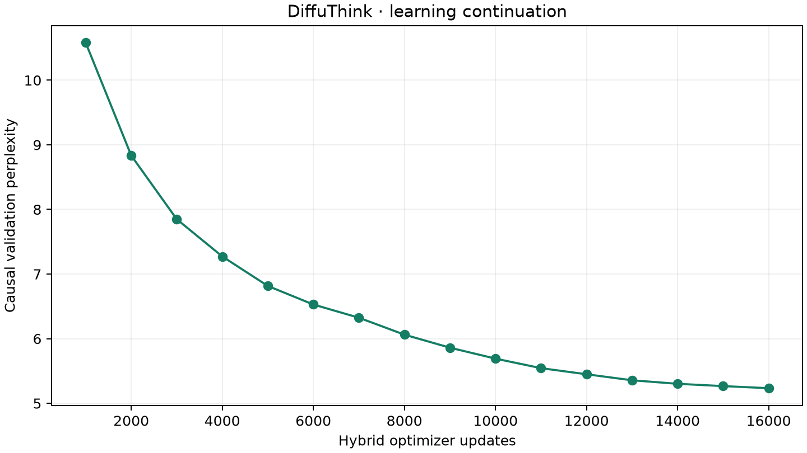

# DiffuThink Hybrid — résultats

Nouvelle phase : **16,000 mises à jour**, 71,702,281 tokens non-PAD présentés au réseau, 18.8 minutes de boucle d'entraînement/validation sur le GPU local. Elle part des poids maison de la V2, sans poids externes. Architecture de 13 337 280 paramètres inchangée.

Le mode de continuation est **autorégressif**, le débruitage restant un objectif auxiliaire et un mode distinct pour compléter des trous. Cette amélioration ne doit pas être présentée comme un gain de génération par diffusion.

## Validation et test

Perplexité de validation au premier checkpoint causal (étape 1000) : 10.579. Dernier checkpoint : 5.234. Sélection par NLL de validation ; poids retenus à l'étape 16000.

Sur 512 fenêtres test : **NLL 1.8779 nats, perplexité 6.540, accuracy prochain token 56.57%**, sur 70,336 cibles. Ce ne sont pas des mesures de cohérence humaine. La V2 n'avait pas été entraînée en causal ; on ne lui attribue pas artificiellement une perplexité comparable.

Fréquence moyenne de trigrammes de sortie répétés sur les 12 prompts : avant 7.05%, après 1.97%. Cet indicateur n'évalue ni la grammaire ni la logique du récit. Les algorithmes de génération ont changé et les sorties ont des longueurs différentes.

## Comparaison exhaustive des prompts fixés

Température 0,5, seed 42, au plus 96 nouveaux tokens. Les sorties brutes sont reproduites sans correction, sans choix du meilleur essai. Le cas utilisateur est un diagnostic connu.

### 1. One day a man was under a tree and

**Avant — diffusion par blocs**

One day a man was under a tree and 
The man was so happy that he had such the best day ever.

**Après — causal sans pénalité de répétition**

One day a man was under a tree and he saw a big tree. He wanted to climb the tree and see what was on the other side. He was very persistent and he kept climbing until he reached the top.
The man was so happy when he saw the tree. He wanted to climb it and see what was on top. He climbed higher and higher until he reached the top. He was so proud of himself and he smiled when he saw the whole town.
The man was so proud of himself for climbing

**Après — réglages recommandés**

One day a man was under a tree and he saw a big tree. He wanted to climb the tree and see what was on top. So he started to climb up the tree. The tree was very tall and it was very high. 
The man was very happy when he reached the top. He looked down and saw a beautiful view. He could see the world from up there. It was so pretty and bright. He wanted it all to himself.
So he climbed higher and higher until he was at the

### 2. Once upon a time, a little girl found

**Avant — diffusion par blocs**

Once upon a time, a little girl found a new puppy. She was so happy and she had a new friend.

**Après — causal sans pénalité de répétition**

Once upon a time, a little girl found a big, red ball. She wanted to play with it, but it was too high up. She asked her mom for help, but she said she was too small.
The little girl felt sad and wanted to help her mom. She went to her mom and asked for help. Her mom said, "Don't worry, we can fix the ball."
So, the little girl and her mom got some tape and started to fix the ball. They fixed the ball

**Après — réglages recommandés**

Once upon a time, a little girl found a big, red ball. She wanted to play with it, but she was too small to reach it. So, she asked her mom for help.
"Mommy, can you help me reach the ball?" she said.
Her mom smiled and said, "Of course, sweetie. I will take you to the park."
The little girl was so happy. She ran to the park and saw a big slide. She climbed up the ladder and slid down. It

### 3. Tom opened the door and saw

**Avant — diffusion par blocs**

Tom opened the door and saw the yellow dress. He was happy and happy. He was so happy.

**Après — causal sans pénalité de répétition**

Tom opened the door and saw a big box. It was a gift from his grandma. It was a present from her grandma. She was very happy and hugged Tom and thanked her.
"Thank you, Tom. You are very brave and kind. I am glad you like your gift. You are very kind and generous. You make me happy and proud. You are my best friend too."
Tom smiled and hugged his grandma. He felt proud and happy. He hugged his grandma and said, "

**Après — réglages recommandés**

Tom opened the door and saw a big box. It was full of toys, books, and toys. Tom wanted to play with it, but he did not know how. He wondered if his mom or dad would be angry if they came home.
He asked his mom and dad, but they did not answer. They were busy talking on the phone. Tom felt sad and bored. He wanted to play more. He thought of a game to hide in the box. He put his toy car under the

### 4. The woman stood on the balcony and

**Avant — diffusion par blocs**

The woman stood on the balcony and went back to the park. She was so happy to see her family.

**Après — causal sans pénalité de répétition**

The woman stood on the balcony and said, "I'm so glad you're here. I'm glad you're safe."
The woman smiled and said, "Thank you for being so kind. I'm glad I could help."
The woman smiled back and said, "You're welcome. I'm glad you're safe. You're my hero."
The woman smiled back and said, "Thank you. I'm glad I could help."
The woman smiled back and said, "You're welcome

**Après — réglages recommandés**

The woman stood on the balcony and said, "I'm so glad you're here. I'm going to help you."
The woman smiled and said, “That's wonderful! Let's go and get some ice cream.” 
So they went to the store and bought some ice cream. The woman was so happy and thanked the woman for her kindness. She ran back home with a big smile on her face.

### 5. A small bird was afraid to fly. One day,

**Avant — diffusion par blocs**

A small bird was afraid to fly. One day, the bird was very sad and wanted to be careful with the bird again.

**Après — causal sans pénalité de répétition**

A small bird was afraid to fly. One day, the bird saw a small bird with a broken wing. The bird was sad and scared. The bird tried to fly away, but the bird was too scared.
The bird saw a big tree and thought to itself, "I will never fly like that bird." So, the bird flew to the tree and tried to get the bird. But the bird was too fast and flew away.
The bird was very sad. It wanted to fly again, but it could not.

**Après — réglages recommandés**

A small bird was afraid to fly. One day, the bird saw a little bird flying in the sky. The bird had a bright idea.
"Let's fly away," said the bird.
The bird flew away and the bird flew away.
"Don't be scared," said the small bird. "I will help you."
So the bird flew back to its nest. It was safe and sound, but it was still scared.
The next day, the small bird saw a big tree. The bird was

### 6. Lily lost her red ball. She looked under the bed and

**Avant — diffusion par blocs**

Lily lost her red ball. She looked under the bed and ran away. She was happy. She was happy. She was happy.

**Après — causal sans pénalité de répétition**

Lily lost her red ball. She looked under the bed and behind the door, but she could not find it. She was very sad and scared. She wished she had never gone to the park.
Then she heard a voice. It was her mom. She said, "Lily, I'm sorry. I lost your ball. I'm sorry I lost it. I wanted to play with it. Can you help me find it?"
Lily looked around and saw her mom's face. She had an idea. She said, "

**Après — réglages recommandés**

Lily lost her red ball. She looked under the bed and behind the door, but she could not find it. She was very sad and scared.
She cried and cried. She wanted to hug her teddy bear, but he did not know how. She wished she had never seen his blue ball.

### 7. The rain stopped, so the children

**Avant — diffusion par blocs**

The rain stopped, so the children were so happy. They watched the sun in the sun in the sky.

**Après — causal sans pénalité de répétition**

The rain stopped, so the children went outside to play in the rain. They ran around and laughed. They had so much fun, and the rain was so much fun!
Suddenly, the rain stopped and the children ran back inside. They were so happy and the rain was over. They ran outside and played in the rain.
The rain was so much fun! The children ran around and laughed, and laughed and smiled. They ran around in the rain, laughing and having fun.
The rain had

**Après — réglages recommandés**

The rain stopped, so the children went outside to play in the park. They saw a big tree and decided to climb it. The sky was blue and the wind was blowing. 
When they reached the top of the tree, they looked up and saw that the ground was full of leaves. The children were amazed by the soft leaves and the bright sun. 
The children smiled and decided to keep going. They went around the tree every day, until one day a big storm came. It was very

### 8. A boy wanted to help his mother, but

**Avant — diffusion par blocs**

A boy wanted to help his mother, but he didn't want to help his mom and he could be sad again.

**Après — causal sans pénalité de répétition**

A boy wanted to help his mother, but she was too busy. She looked around and saw a big box. She wanted to open it, so she asked her mother if she could. Her mother said yes, and the boy was so excited. He opened the box and found a toy car. He was so happy! He hugged the toy car and thanked his mother. She was so happy to have helped him. She hugged the toy car and ran to show her friends. They all had a great time playing with the

**Après — réglages recommandés**

A boy wanted to help his mother, but she was too busy. She decided to take a walk and asked him to get her help. He had been walking for a long time and he felt very happy.
The boy's mother said it was ok to help him, so they went together. The boy was so excited to be able to help his mom.
They walked around the park and the boy looked around. He saw a big tree with a hole in it. He thought it would be fun to climb up

### 9. The dog saw a cat near the river. It

**Avant — diffusion par blocs**

The dog saw a cat near the river. It was so happy and it wanted to play with the dog in the park.

**Après — causal sans pénalité de répétition**

The dog saw a cat near the river. It was a small, furry cat. The dog was very scared and ran away. The cat was happy that it had found a new friend.

**Après — réglages recommandés**

The dog saw a cat near the river. It was very sad and angry. The cat wanted to help the cat, so it ran to get her mom.
"Mom, I'm sorry!" said the cat. "I want to help the mouse."
"Don't worry," said Mom. "We can fix it together. We can take it to the vet."
The cat was happy and thanked Mom. They worked together to fix the cat's fur. After a few days, the cat was able to get

### 10. Anna opened the box. Inside, she found

**Avant — diffusion par blocs**

Anna opened the box. Inside, she found a new toy box. She was happy. She had a new friend.

**Après — causal sans pénalité de répétition**

Anna opened the box. Inside, she found a big, round ball. She was so happy! She picked up the ball and played with it all day.
Anna and her mom watched as the ball rolled and rolled. It rolled and rolled until it reached the other side of the room. It was so much fun!
Anna and her mom watched the ball go and forth. They laughed and smiled as it rolled around. They had a lot of fun.
At the end of the day, Anna and her mom

**Après — réglages recommandés**

Anna opened the box. Inside, she found a big, round, green leaf. She was very happy and decided to share it with her friends. They all laughed and played together in the garden.
But then Anna noticed something strange. There was a big, scary spider! It had sharp teeth and claws and claws. It was scared of Anna's finger and wanted to run away. Anna ran after it, but she could not reach it. She screamed for help, but no one heard her.
The spider saw

### 11. Ben was sad because his friend

**Avant — diffusion par blocs**

Ben was sad because his friend was sad. He knew that he was able to play with his friends.

**Après — causal sans pénalité de répétition**

Ben was sad because his friend was sick. His friend was sick and he had to go to the doctor. The doctor said he needed a doctor and he needed a doctor. He had a big bag of medicine and a bandage.
"Don't worry, Ben. I have a doctor. He will help you feel better soon. He will be fine soon."
Ben did not want to be sick. He wanted to play with his toys and his mom. He did not like the doctor. He wanted

**Après — réglages recommandés**

Ben was sad because his friend Tom was not. He had a big box of toys in his room. He did not like to share his toys with Tom. He wanted to be nice and share his toys.
He went to his room and opened the box. He saw many toys inside. He saw cars, dolls, balls, and books. He liked cars and trucks, but he did not want to share his toy with him. He said, "This is my car. You can have it back

### 12. The old man planted a tree. Every morning,

**Avant — diffusion par blocs**

The old man planted a tree. Every morning, the little boy and the little boy would always be careful with the tree.

**Après — causal sans pénalité de répétition**

The old man planted a tree. Every morning, he would look for the perfect spot to rest. He would look for a spot to rest and soon he found a big tree. He was so happy! He had a spot to rest and he felt so comfortable. He lay down and closed his eyes. He was ready to rest.
The old man lay down in the tree and closed his eyes. He was so content and happy to rest. He felt so peaceful and cozy. He closed his eyes and fell asleep.

**Après — réglages recommandés**

The old man planted a tree. Every morning, he would look for something special. He was very happy and content.
One day, he heard a loud noise. It was a big bird. The old man was scared and ran away.
He saw a big tree. He thought it was a good place to hide. So he decided to find another way to get the bird.
He looked around and found a big tree with lots of leaves. He was so happy! He grabbed the leaves and started to climb.

## Limites

Petit modèle anglais, corpus synthétique, contexte limité et possibles erreurs de cohérence. Pas de revue humaine aveugle, pas de preuve de perfection. Les métriques de débruitage après adaptation sont dans report.json pour vérifier le compromis entre les deux tâches.
