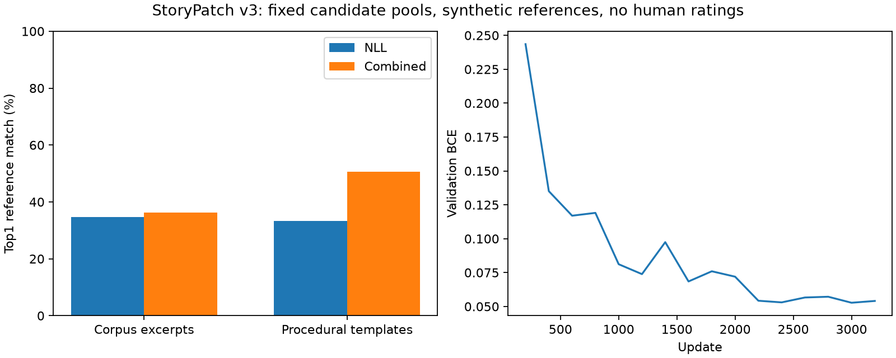

# StoryPatch v3 : classement contextuel

Un classeur de **13,645,761 paramètres** a été entraîné sur
**24 000 contextes**, dont 12 000 extraits variés du corpus. Il reprend le
backbone de notre propre DiffuThink, dont la lignée part d’une initialisation
aléatoire, puis apprend une nouvelle tâche de classement. Aucun poids externe.
Checkpoint retenu : **étape 3000**, choisi par validation.

## Résultats sur 1 200 entrées / 600 contextes

Moitié extraits TinyStories, moitié gabarits. Chaque contexte possède une
version altérée et une version correcte. Toutes les étiquettes sont
synthétiques ; les extraits servent de références de reconstruction, sans
évaluation humaine de toutes les formulations possibles.

| Mesure | NLL | Classement combiné |
|---|---:|---:|
| Extraits du corpus : première variante conforme | 34.7% | 36.3% |
| Extraits du corpus : réparation conseillée | 34.7% | 15.0% |
| Extraits du corpus : original correct conservé | 63.3% | 99.7% |
| Gabarits procéduraux : première variante conforme | 33.3% | 50.7% |
| Gabarits procéduraux : réparation conseillée | 31.7% | 2.0% |
| Gabarits procéduraux : original correct conservé | 29.3% | 100.0% |

Sur les 36 anciens diagnostics réutilisés : **75.0%** de
premières variantes acceptées avec la NLL, **75.0%** avec
le classement combiné. Sur exactement les mêmes propositions, le précédent
classeur v2 obtient **55.6%**
(scores FP32 sur CPU). Ils ne constituent pas un test nouveau ou indépendant.

La couverture des réponses de référence est de
**43.7%** dans les extraits
et **51.0%** dans les
gabarits. Reclasser ne peut pas créer une réponse absente des propositions.
Le générateur est identique dans toutes les comparaisons de cette expérience.

Le classement s’améliore, mais le conseil de remplacement est **très
conservateur** : il répare seulement
**8.5%** des
entrées altérées, contre **33.2%**
avec le conseil fondé sur la NLL seule. Les propositions restent consultables
et applicables manuellement. Sur les extraits du corpus, le taux de remplacement
hors référence atteint **19.3%** :
la contrainte globale de validation ne se généralise pas à ce sous-groupe.

## Choix sur validation

Poids du score appris : **0.05** dans
`-NLL + poids × clip(score_appris, -8, 8)`. La validation compare séparément
les deux domaines, exigeant l’absence de régression de classement dans chacun.
Le score borné évite qu’une prédiction extrême domine sans limite la NLL.

Marge de remplacement : **1.5** ;
score minimal : **-2**.
Sur les 480 entrées de calibrage : réparation 11.7%,
conservation 99.6%, remplacement hors référence
sur entrées altérées 9.6%.
Ces contraintes ne garantissent pas les mêmes taux sur d’autres textes.

L’exploration NLL reste disponible par défaut. Le nouveau modèle s’essaie via
« Classement contextuel · expérimental ». Les résultats ne justifient pas
de prétendre à un correcteur général ou à une compréhension fiable.

Le fichier `evaluation.json` contient les résultats complets, les 36 diagnostics
et les empreintes. Les fichiers `*_predictions.jsonl` conservent toutes les
propositions. `selection.json` garde toute la grille essayée en validation.
`blind_review.csv` prépare 100 comparaisons avec ordre des méthodes masqué,
réparties entre domaines et entrées correctes/altérées. Les jugements restent
vides : aucune évaluation humaine n’a été effectuée.
[Protocole](../../docs/STORYPATCH_CONTEXT_V3.md) ·
[Attribution des extraits](DATA_LICENSE.md).
