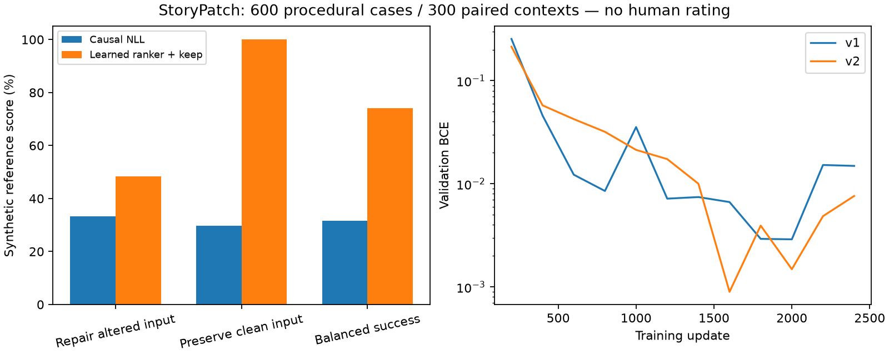

# StoryPatch : résultats du classeur appris

Un réseau indépendant de **3,528,769 paramètres**, initialisé
aléatoirement, classe les variantes du générateur DiffuThink de 13,44 M.
Le générateur et ses poids restent inchangés dans cette expérience.
Le checkpoint retenu est l’étape **1600**, choisie par BCE de validation.
Disponible en mode expérimental : **oui**.
Le classement habituel NLL reste le mode par défaut de l’interface.

## Test figé : 600 cas, 300 contextes

300 versions altérées et 300 correctes ; six catégories de récits simples.
Étiquettes procédurales synthétiques, sans validation humaine. Les deux
méthodes reçoivent les mêmes propositions. Le classement NLL peut conseiller
de garder l’original si aucune proposition ne réduit sa NLL.

| Mesure | NLL + conservation | Classement appris + conservation |
|---|---:|---:|
| Réparation des entrées altérées | 33.3% | 48.3% |
| Conservation exacte des entrées correctes | 29.7% | 100.0% |
| Réussite équilibrée | 31.5% | 74.2% |
| Remplacement hors référence sur entrées altérées | 61.3% | 10.0% |

L’intervalle descriptif de la différence de réussite équilibrée, bootstrap
apparié par contexte (1 000 tirages), est [38.7, 46.7]
points. Il ne mesure pas la validité sur du texte libre.

Sans l’option de conservation, la première variante correspond à une réponse
acceptée dans **35.0%** des entrées altérées avec
la NLL, contre **49.3%** avec le classeur.
La réponse acceptée est disponible quelque part dans les propositions dans
**52.3%** des cas. Le classeur ne peut pas créer
une réponse absente de cette liste. Préservation du contexte :
**100.0%**, par composition exacte des chaînes.

## Régression hors gabarits

Sur les 36 anciens diagnostics : première variante acceptée 72.2% avec la NLL, contre 52.8% avec le classeur ; recommandation acceptée 33.3%. Ces probes ne servent ni au choix des poids ni au calibrage. Cette régression conduit à conserver la NLL par défaut dans l’interface et à proposer le classeur comme mode expérimental explicite. Voir `legacy_probes.json`.

## Décision et provenance

Seuils choisis sur 240 cas de validation, jamais sur le test : marge
**12**, score minimal
**2**. Le score est une préférence
apprise, sans interprétation comme probabilité de correction.
Validation : réparation 51.7%, conservation
100.0%, remplacement hors référence sur
entrées altérées 6.7%.

12 000 contextes d’entraînement ; 2 699 propositions supplémentaires
extraites sur 1 200 de ces contextes et étiquetées avec une liste de réponses
fermée. Certaines formulations valides peuvent être étiquetées à tort.
Le corpus est procédural, avec gabarits séparés et contextes dédupliqués.
Les noms, mots et structures restent proches entre splits.

La première expérience, conservée dans `../storypatch-ranker-v1`, avait
appris à classer des contrastes trop simples. Son calibrage choisissait de
tout conserver. Le deuxième corpus et ses alternatives explicites ont été
figés avant le second entraînement ; les décisions d’amélioration sont
issues de la validation de la première expérience. Les 600 nouveaux cas
ne constituent pas une étude indépendante d’une équipe tierce.

`evaluation.json` contient les résultats par catégorie et les empreintes.
`test_predictions.jsonl` contient toutes les sorties. `selection.json`
documente la règle de déploiement fondée sur la validation.
`blind_review.csv` prépare une comparaison humaine masquée ; ses colonnes
de jugement sont **vides**. Aucun gain confirmé par des personnes n’est annoncé.

[Protocole et reproduction](../../docs/STORYPATCH_RANKER.md).
Développement et documentation assistés par IA. Résultat local ; cette étape
n’a pas téléversé de nouveau modèle sur Hugging Face ou GitHub.
