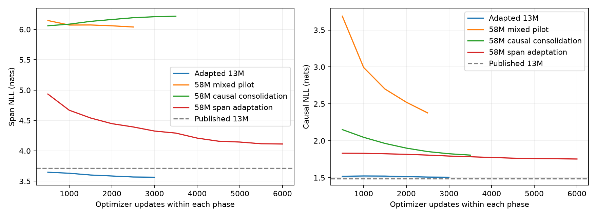

# StoryPatch v2 — résultats mesurés

Modèle retenu sur validation : **Adapted 13M** (`runs/storypatch-13m/best`).

La sélection utilise uniquement 256 fenêtres de validation. Le score fixé avant entraînement est `NLL span + 0,25 × NLL causale`, avec une amélioration de reconstruction et au plus 10 % de régression de NLL causale.

Le gain reste modeste : le premier choix accepté passe de 25/36 à 26/36, tandis que le top-3 passe de 29/36 à 28/36. La perplexité causale se dégrade légèrement. Le modèle de 58M reste inférieur avec le budget testé ; il n’est pas retenu pour la démo. La précision de reconstruction progresse, mais aucune amélioration générale ou statistiquement démontrée de cohérence n’est revendiquée.

## Test indépendant

| Mesure | Publié 13M | Adapté 13M | Depuis zéro 58M |
|---|---:|---:|---:|
| NLL reconstruction (400 passages) | 3.820 | 3.681 | 4.179 |
| Tokens reconstruits correctement | 26.2% | 28.4% | 23.5% |
| Reconstruction parallèle exacte | 13.8% | 15.8% | 12.0% |
| Reconstruction itérative exacte (64 passages) | 14.1% | 18.8% | 7.8% |
| Perplexité causale (mêmes 400 fenêtres) | 5.146 | 5.258 | 6.744 |
| Premier choix accepté (36 cas) | 69.4% | 72.2% | 52.8% |
| Au moins un choix accepté dans les 3 premiers | 80.6% | 77.8% | 58.3% |
| Contexte conservé hors sélection | 100.0% | 100.0% | 100.0% |
| Latence médiane éditeur (ms, GPU local) | 89 | 70 | 128 |

Les scores de reconstruction comparent la sortie au texte source : des variantes valides peuvent être comptées comme fausses. Les 36 cas sont des sondes synthétiques rédigées pour le diagnostic, sans revue humaine aveugle. Leur liste de réponses acceptées est incomplète. Aucun score général de cohérence ou de correction grammaticale n’est revendiqué.

Une vérification CPU est conservée dans `adapted13m_cpu.json`. Elle a tourné pendant l’entraînement GPU ; sa latence inclut la concurrence pour les ressources et ne constitue pas une mesure de performance isolée. FP32 sur CPU et BF16 sur GPU peuvent donner des propositions et scores de sondes différents.

Les valeurs de perplexité ci-dessus utilisent les mêmes fenêtres pour les trois modèles ; elles ne sont pas directement comparables au score historique de 6,147 sur des fenêtres de 192 tokens.

## Tous les premiers choix, y compris les échecs

| ID | Passage original | Publié 13M | Adapté 13M | Depuis zéro 58M |
|---|---|---|---|---|
| challenge-000 | happy | very sad ✓ | very sad ✓ | sad ✓ |
| challenge-001 | sad | happy ✓ | happy ✓ | happy ✓ |
| challenge-002 | calm | scared ✓ | very sad | sad |
| challenge-003 | full | very sleepy | very sad | very hot |
| challenge-004 | awake | so tired | sleepy ✓ | very sleepy |
| challenge-005 | angry | very happy ✓ | very happy ✓ | so happy |
| challenge-006 | red | blue ✓ | blue ✓ | blue ✓ |
| challenge-007 | green | red ✓ | red ✓ | red ✓ |
| challenge-008 | book | ball ✓ | ball ✓ | ball ✓ |
| challenge-009 | stone | seed ✓ | seed ✓ | seed ✓ |
| challenge-010 | shoe | book ✓ | book ✓ | book ✓ |
| challenge-011 | chair | cake ✓ | cake ✓ | cake ✓ |
| challenge-012 | something | no | no | no |
| challenge-013 | dry | wet ✓ | wet ✓ | wet ✓ |
| challenge-014 | hot | even bigger | tall | bigger |
| challenge-015 | bright | dark ✓ | dark ✓ | dark ✓ |
| challenge-016 | open | not open ✓ | not open ✓ | help |
| challenge-017 | many | no more | no more | a |
| challenge-018 | outside | together | together | with toys |
| challenge-019 | on | under ✓ | under ✓ | in |
| challenge-020 | pond | nest ✓ | nest ✓ | nest ✓ |
| challenge-021 | sky | pond, | pond ✓ | pond ✓ |
| challenge-022 | shoe | pocket ✓ | pocket ✓ | pocket ✓ |
| challenge-023 | floor | table ✓ | table ✓ | table ✓ |
| challenge-024 | He | She ✓ | She ✓ | She ✓ |
| challenge-025 | She | He always | He ✓ | He ✓ |
| challenge-026 | She | They ✓ | They ✓ | They were |
| challenge-027 | cat | puppy ✓ | puppy ✓ | dog ✓ |
| challenge-028 | He | They ✓ | They ✓ | They ✓ |
| challenge-029 | fish | bird ✓ | bird had | bird had |
| challenge-030 | walk | went | went | went |
| challenge-031 | eat | would take | ate | took out |
| challenge-032 | was | were ✓ | were ✓ | was a |
| challenge-033 | was | were ✓ | were ✓ | were ✓ |
| challenge-034 | go | went ✓ | went ✓ | went to |
| challenge-035 | a | the | the | some |

Les JSON associés contiennent les textes complets, toutes les propositions, les métriques par catégorie et les empreintes des fichiers.

## Entraînement

- `storypatch-13m` : 3,000 mises à jour, 2.4 minutes ; checkpoint retenu à l’étape 3,000. À ce checkpoint : 15,141,999 tokens présentés, 7,901,936 cibles supervisées.
- `storypatch-58m` : 2,500 mises à jour, 6.5 minutes ; checkpoint retenu à l’étape 2,500. À ce checkpoint : 12,556,941 tokens présentés, 6,545,022 cibles supervisées.
- `storypatch-58m-causal` : 3,500 mises à jour, 11.9 minutes ; checkpoint retenu à l’étape 3,500. À ce checkpoint : 17,593,932 tokens présentés, 17,509,932 cibles supervisées.
- `storypatch-58m-edit` : 6,000 mises à jour, 20.8 minutes ; checkpoint retenu à l’étape 6,000. À ce checkpoint : 30,305,009 tokens présentés, 15,616,625 cibles supervisées.

Le pilote 58M entraîné directement avec les deux objectifs a stagné près de 6 % de précision de reconstruction. Il a été interrompu après le checkpoint 2 500 ; quelques mises à jour ultérieures non sauvegardées ont été abandonnées. Ses poids ont ensuite suivi une consolidation causale puis une spécialisation sur les passages. Ce changement a été décidé sur validation, avant les scores test des candidats. Voir `pilot_notes.json`.

Le modèle de 58M part de poids aléatoires ; celui de 13M poursuit notre propre modèle appris depuis zéro. Cette comparaison ne contrôle pas tout l’historique de calcul et ne permet pas d’attribuer un résultat à la taille seule.

Protocole : [STORYPATCH_V2.md](../../docs/STORYPATCH_V2.md). Texte source TinyStories : CDLA-Sharing-1.0. Code : Apache-2.0. Développement assisté par IA.
