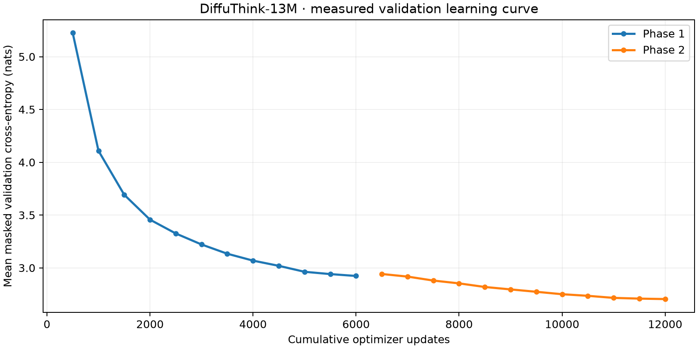

# DiffuThink V2 — résultats mesurés

**13 337 280 paramètres, 12,000 mises à jour, 53,724,183 tokens non-PAD présentés au réseau** (incluant les répétitions et tokens de contrôle), environ 16.3 minutes cumulées de boucle d'entraînement/validation. Ce temps exclut préparation et installation. GPU : AMD Radeon RX 9060 XT, BF16. Le corpus contient 21 134 655 occurrences de tokens textuels avant répétitions, pas 53,724,183 tokens uniques.

Les deux phases proviennent de la même initialisation apprise depuis zéro. La seconde redémarre l'optimiseur à un learning rate plus faible. Les poids sélectionnés par validation proviennent de l'étape 6000 de cette seconde phase. Les rapports JSON incluent toute la filiation.

## Reconstruction sur test

512 fenêtres tenues à l'écart, masques reproductibles ; unité : sous-mot BPE.

| Masquage | Accuracy top-1 | Top-5 | CE en nats | Unigramme top-1 |
| --- | ---: | ---: | ---: | ---: |
| 15% | 61.04% | 78.99% | 2.006 | 6.96% |
| 50% | 48.76% | 69.67% | 2.687 | 7.06% |
| 85% | 25.02% | 45.12% | 4.265 | 7.13% |

Ces valeurs ne se comparent pas aux 89,1 % de la V1 (autres données, autres unités). Elles ne mesurent pas la cohérence des générations.

## Comparaison des politiques

64 fenêtres de test, mêmes masques à 50 %, température zéro. GPU BF16 après chauffe. Pas d'intervalle de confiance : les petits écarts ne constituent pas une preuve de supériorité.

| Politique | Accuracy masquée | Passes moyennes | Latence moyenne |
| --- | ---: | ---: | ---: |
| one_pass | 52.62% | 1.00 | 8.4 ms |
| left_to_right | 52.20% | 11.23 | 85.0 ms |
| confidence | 53.33% | 11.23 | 82.3 ms |
| adaptive | 53.40% | 11.09 | 80.8 ms |

**Bigramme bidirectionnel contextuel : 29.36%** sur exactement les mêmes positions. Il ne voit que les voisins non masqués. Le coût de préparation du bigramme n'est pas inclus dans une comparaison de latence.

Le budget adaptatif est une heuristique et son gain doit être jugé sur ces mesures. Une passe peut être compétitive en reconstruction même si la démonstration utilise plusieurs passes. Aucun résultat d'état de l'art n'est revendiqué.

## Générations non filtrées

Prompts fixés à l'avance, seed 42, température 0,7, blocs de 16, au plus 64 nouveaux tokens. Toutes les sorties du benchmark sont reproduites ici, y compris celles qui sont maladroites. Aucun choix du meilleur parmi plusieurs essais.

**Prompt :** Once upon a time, a little girl found

> Once upon a time, a little girl found a hug. She was so happy that she had fun with her friends.

**Prompt :** Tom opened the door and saw

> Tom opened the door and saw the perfect girl. He was so happy he He had a fun day.

**Prompt :** The woman stood on the balcony and

> The woman stood on the balcony and thanked the lady. She was so happy that she had a great day.

**Prompt :** A small bird was afraid to fly. One day,

> A small bird was afraid to fly. One day, the bird went to the bird and the bird went home in the tree.

## Limites

Récits synthétiques anglais, vocabulaire et domaine limités ; répétitions, incohérences et erreurs grammaticales possibles. Déduplication exacte seulement. Les partitions sont disjointes par document, mais des récits similaires peuvent subsister. Une seule trajectoire d'entraînement en deux phases, pas une étude multigraines. Le benchmark de reconstruction n'est pas une évaluation humaine de qualité. Les rapports intermédiaires de test sont conservés ; ce travail reste exploratoire.

Le projet et le code ont été développés avec assistance IA. Les contributions à présenter sont le pipeline, les choix expliqués et les expériences réellement reproduites personnellement.
